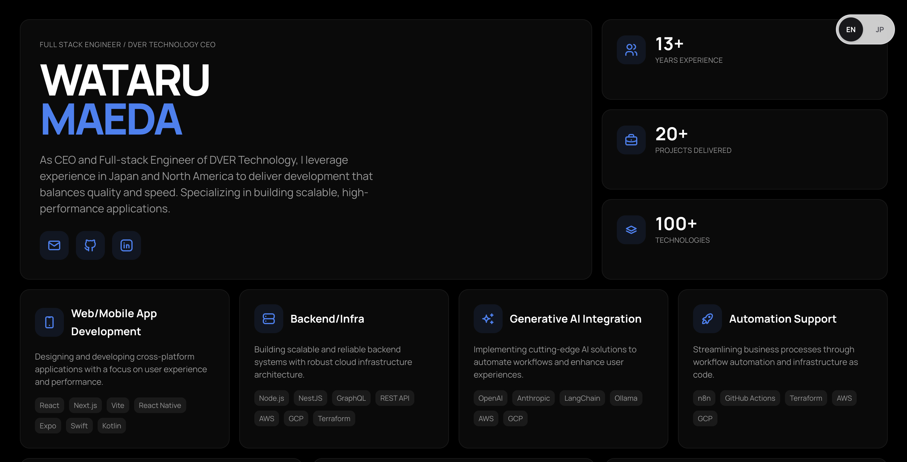

# Portfolio

Modern portfolio website showcasing my work as a Full-Stack Software Engineer, built with React, TypeScript, and deployed on GitHub Pages.



## Live Site

[watarumaeda.com](https://watarumaeda.com)

## Tech Stack

- **Frontend**: React 19, TypeScript, Chakra UI v3
- **Build Tool**: Vite
- **Backend**: Express.js (for local development)
- **Styling**: Emotion, Framer Motion
- **Internationalization**: i18next
- **Hosting**: GitHub Pages

## Design & Content

- **Design**: [Manus](https://manus.app) - Used for site design and layout
- **Content Generation**: Claude AI and NotebookLM - Assisted in generating website content
- **Hosting**: GitHub Pages - Static site hosting with custom domain

## Development

```bash
# Install dependencies
npm install

# Run development server
npm run dev

# Build for production
npm run build

# Type checking
npm run check
```

## Deployment

This site is automatically deployed to GitHub Pages via GitHub Actions when changes are pushed to the `main` branch.

## Features

- SEO optimized with meta tags, Open Graph, and structured data
- Responsive design for mobile and desktop
- Dark mode theme
- Multi-language support (English/Japanese)
- Custom domain configuration
- Progressive Web App ready

## License

© 2026 Wataru Maeda. All rights reserved.
